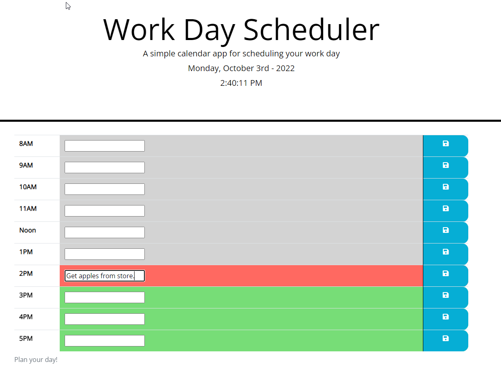

# 05-DailyPlanner
# Submitted by Conor Donnelly - October 3, 2022

This challenge required us to write code using JQuery in order to apply conditional logic and styling to a daily planner web page that changes color for rows in a 3x8 table according to the current hour of the day. 

We applied the moment.js library to work with date/time variables and change formatting accordingly.

Also needed to use the font awsome css stylesheet CDN in order to pull a Save icon into the HTML table.

Bootstrap made it easy to apply some default table structure to the task grid.

## Page URL
(https://riversidempls.github.io/05-DailyPlanner/)

## Screenshot

